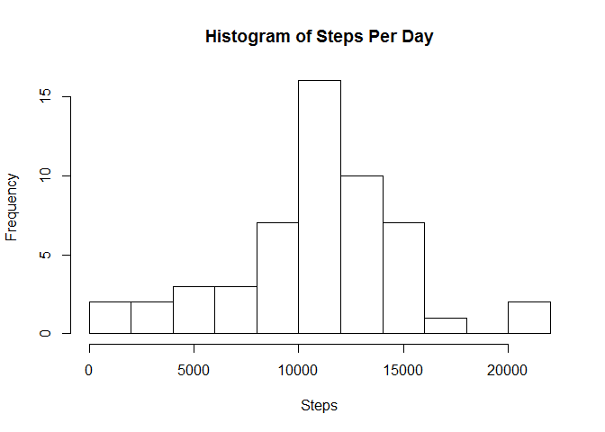
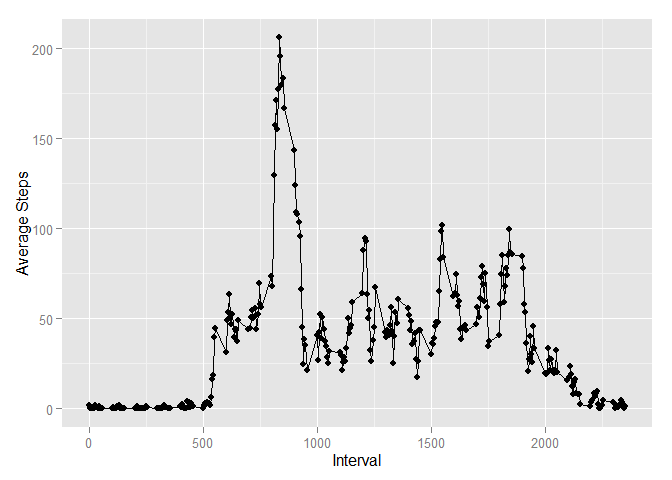
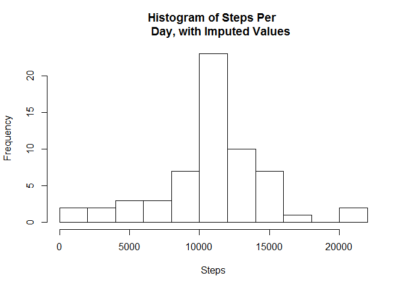
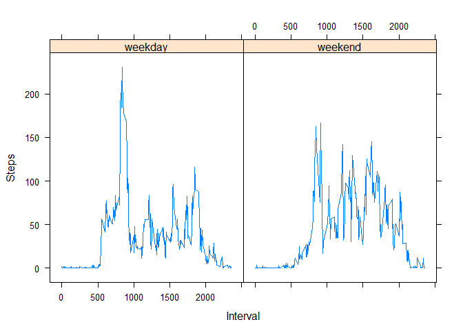

# Reproducible Research: Peer Assessment 1
Brian Weeden  
Saturday, January 17, 2015  

##Introduction
This report will explore a data set of steps taken by an individual over the course of the months of October and November 2012.  The steps taken were recorded by an activity tracking device.

## Loading and preprocessing the data
First we load the data and a few libraries we need for the analysis to follow:

```r
setwd("~/Reproduceable Research")
activities <- read.csv("activity.csv")
library(ggplot2)
library(data.table)
library(lattice)
activities$date <- as.Date(activities$date)
activities <- activities[activities$date > '2012-10-01', ]
head(activities)
```

```
##     steps       date interval
## 289     0 2012-10-02        0
## 290     0 2012-10-02        5
## 291     0 2012-10-02       10
## 292     0 2012-10-02       15
## 293     0 2012-10-02       20
## 294     0 2012-10-02       25
```

The first day of activities was dropped because all of the values for steps taken for that day were missing.  Other missing values have been left in the data set, for now.  The data set consists of steps taken during five minute intervals over each day the tracker was used.


## What is mean total number of steps taken per day?
Let's examine a histogram of the number of steps taken per day:

```r
stepsPerDay <- aggregate(steps ~ cut(date, "1 day"), activities, sum)
names(stepsPerDay) <- c("day", "steps")
hist(stepsPerDay$steps, xlab="Steps", main="Histogram of Steps Per Day", 
     breaks=10)
```

 

Steps per day seem to be fairly normally distributed, with most days ending up slightly over 10,000 steps.  Let's take a look at some the mean and median for steps per day:

```r
mean(stepsPerDay$steps)
```

```
## [1] 10766.19
```

```r
median(stepsPerDay$steps)
```

```
## [1] 10765
```


## What is the average daily activity pattern?
Let's take a look at the average number of steps taken, by interval (averaged across all days):

```r
activities <- data.table(activities)
stepsByInterval <- activities[, mean(steps, na.rm=TRUE), by=interval]
qplot(interval, V1, data=stepsByInterval, xlab="Interval", 
      ylab="Average Steps") + geom_line()
```

 

```r
stepsByInterval[stepsByInterval$V1==max(stepsByInterval$V1), interval] 
```

```
## [1] 835
```

From the plot, you can see that generally the most activity seems to happen in he morning.  In fact, the interval where the maximum number of steps were taken is interval 835, which represents 8:35 AM.


## Imputing missing values
Several intervals were missing values.  Let's take a look at how many:

```r
sum(is.na(activities$steps))
```

```
## [1] 2016
```

For the rest of the analysis, we've chosen to impute those missing values as the average number of steps taken for that interval taken across all days in the sample.  Below we'll show the code for how we filled in the unavailable (NA) data with the averages, show that there are now zero NA step values, and also show a histogram, mean, and median for the data with the imputed values:

```r
populatedActivities <- merge(activities, stepsByInterval, by="interval")
populatedActivities$steps <- ifelse(is.na(populatedActivities$steps), 
                                    populatedActivities$V1, 
                                    populatedActivities$steps)
sum(is.na(populatedActivities$steps))
```

```
## [1] 0
```

```r
imputedStepsPerDay <- aggregate(steps ~ cut(date, "1 day"), 
                                populatedActivities, sum)
names(imputedStepsPerDay) <- c("day", "steps")
hist(imputedStepsPerDay$steps, xlab="Steps", main="Histogram of Steps Per 
     Day, with Imputed Values", breaks=10)
```

 

```r
mean(imputedStepsPerDay$steps)
```

```
## [1] 10766.19
```

```r
median(imputedStepsPerDay$steps)
```

```
## [1] 10766.19
```

From the histogram, it looks like our data with NAs imputed has a little bit narrower spread (so, a lower standard deviation).  The new data set has the same mean as the original, but the median has now become identical to the mean.  This is probably because some common missing values were replaced with the average for that interval, which was equal to the overall average.  The mean and median are still very close to the original values, with the mean being the same, so the impact on the data seems mostly limited to removing some variability.

## Are there differences in activity patterns between weekdays and weekends?
Below we will take a look at a time series plot of the activity, split out by whether the activity occurred on a weekday or on a weekend:

```r
populatedActivities$workday <- factor(with(populatedActivities, 
                                           ifelse(weekdays(date) %in% c("Saturday","Sunday"), "weekend", "weekday")))
stepsByIntervalWorkdayImputed <- populatedActivities[, mean(steps, na.rm=TRUE), by="workday,interval"]
xyplot(V1~interval|workday, data=stepsByIntervalWorkdayImputed, type="l", 
       xlab="Interval", ylab="Steps")
```

 

You can see a clear difference in pattern here, with the individual getting most of their activity in in the mornings on weekdays, but more spread out throughout the day on weekends.
